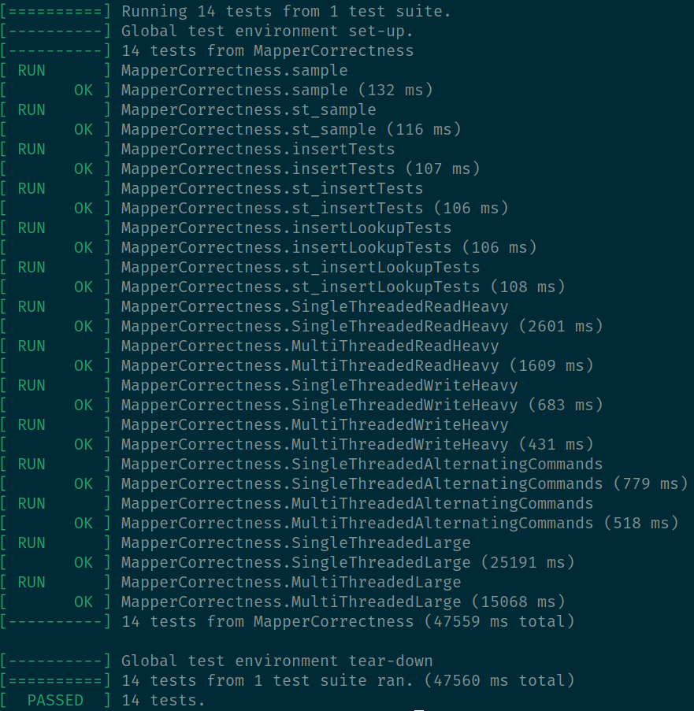

# Multithreaded Unordered HashMap

A thread-safe hashmap written in C++ using pthreads. Achieves scaling for both read and write operations while ensuring thread-safety and correctness.

## Compilation

To compile, run the following commands:

```bash
mkdir build
cd build/
cmake ..
make
cp src/mapper mapper
```

OR

```bash
bash build.sh
```

This will produce a *mapper* executable that takes two parameters:

1. Relative path to input file
2. Relative path to output file

To clean any files created by cmake, run the following in the main directory:

```bash
bash clean.sh
```

## Approach

Between implementing a multithreaded binary search tree or a hashmap, it seemed more interesting of a problem to pursue the binary search tree. This was the case; 
however, my implementations were not able to scale properly. I had no issues with read scaling. I was not able to get writing to scale without introducing race conditions.
I believe it is possible if using domain-knowledge of the tasks the other threads are completing and their place in the queue. Perhaps that is a problem to continue pursuing another day. 

In this program, I have implemented a thread-safe hashmap. The hashmap wraps a fixed-size array with separate chaining for collision resolution. This could be easily expanded to 
allow for a resizable hash map, but that was not the focus of this project. A primary design consideration for this project was to ensure correctness. All writes to the hashmap 
**must** be correct in the order they are executed. This is accomplished by locking the hashmap bucket (linked list) with a mutex. In the case of a collision, the thread 
is placed into a queue (FIFO -> linked list). This queue ensures that operations are executed sequentially in the case of a collision. Provided an optimal hashing algorithm, the maximum size of each bucket should be small, resulting in few collisions. It provides correctness in the case of alternating reads and writes to the same index. Using a hashmap in this way allows for easily scalable multithreaded performance while also providing thread safety.

## Testing

I created several tests for the program that check if it could handle basic correctness tests for each hashmap operation, large input handling, and thread scaling. 
Given an input file, the mapper program executes the operations given and produces an output file with the results that are then matched against the expected output files using gtest.

Map Operations (Single vs. Multithreading)
- Insertion
- Search
- Deletion

Test for Large Numbers of Operations (Single vs. Multithreading):
- 1M Operations Test

Tests for Scaling
- Single-threaded Runtime
- Multithreaded Runtime

Operation Ordering Correctness
- Alternating insertions and deletions on the same key


## Performance

We were able to scale our performance with using more threads while still ensuring the correctness of our program by using a queue in instances of collisions.

See the test performance results below for specific performance scaling


